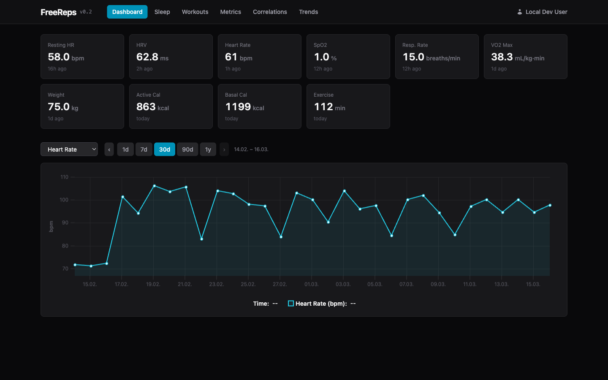
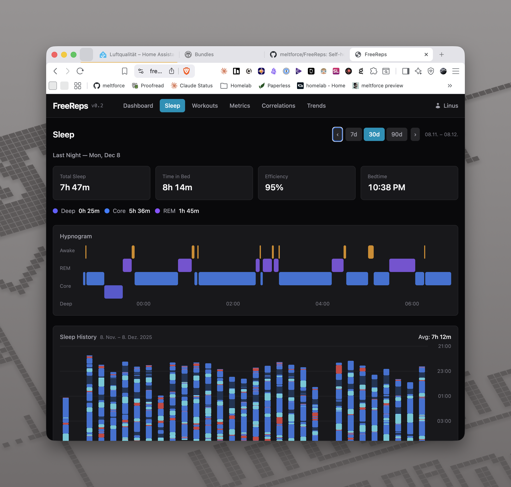
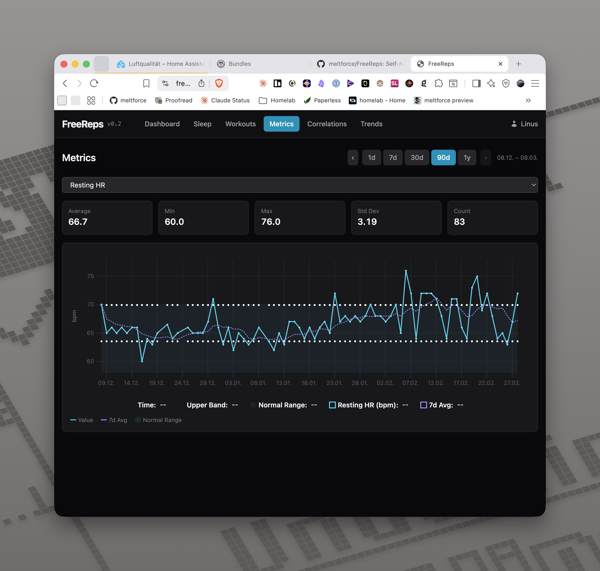
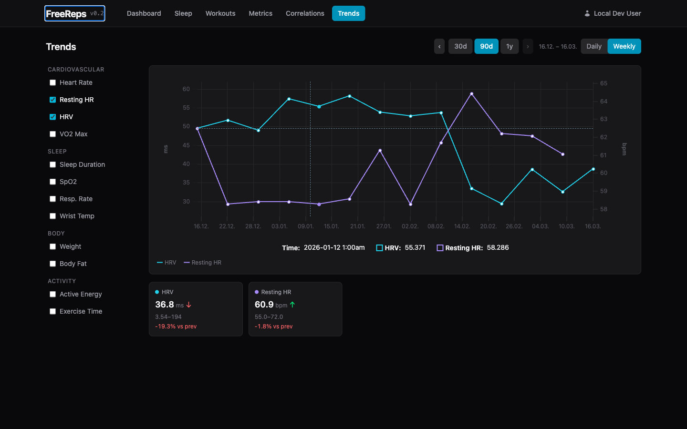

# FreeReps

**F**reely hosted **Re**cords, **E**valuation & **P**rocessing **S**erver

A self-hosted server that receives Apple Health data, stores it persistently, visualizes it through a web dashboard with freely configurable correlations, and exposes it as an MCP server for LLMs.

**Monorepo:** `server/` contains the Go backend + React frontend. `app/` contains the iOS companion app that syncs HealthKit data directly to the server.

## Acknowledgements

The FreeReps iOS companion app is based on [HealthBeat](https://github.com/kempu/HealthBeat) by kempu, an open-source iOS app for syncing Apple Health data. HealthBeat was adapted into the FreeReps companion app for the self-hosted FreeReps server. Licensed under the MIT License.

## Screenshots

| Dashboard | Sleep |
|:-:|:-:|
|  |  |

| Metrics | Trends |
|:-:|:-:|
|  |  |

## Why FreeReps?

Apple Health collects extensive data but offers no way to relate metrics to each other, no API for external analysis, and no export into a queryable system you own.

Other apps compute scores but are closed-source, subscription-based, and opaque. FreeReps takes the opposite approach: **raw data + flexible visualization + LLM for interpretation**.

## Architecture

```
┌──────────────┐     HealthKit       ┌─────────────────────────────────────────┐
│ FreeReps     │ ────────────────→   │              FreeReps Server            │
│ iOS App      │    HTTP POST        │                                         │
└──────────────┘                     │  ┌──────────┐  ┌─────────────────┐     │
                                     │  │ Ingest   │→ │  Storage (DB)   │     │
                                     │  │ API      │  │  Time Series    │     │
                                     │  └──────────┘  └────────┬────────┘     │
                                     │                         │              │
                                     │              ┌──────────┴──────────┐   │
                                     │              ▼                     ▼   │
                                     │  ┌────────────────┐  ┌─────────────┐  │
                                     │  │ Web Dashboard  │  │ MCP Server  │  │
                                     │  │ Correlations   │  │ stdio / SSE │  │
                                     │  │ Trends, Charts │  └──────┬──────┘  │
                                     │  └────────────────┘         │         │
                                     └─────────────────────────────┼─────────┘
                                                                   ▼
                                                          Claude (via MCP)
                                                          = the actual
                                                            "AI coach"
```

## Tech Stack

| Component | Technology |
|-----------|------------|
| Backend | Go (single binary with embedded frontend) |
| Frontend | React 19 + Vite + Tailwind CSS 4 |
| Charts | uPlot (time-series) + Recharts (bar/scatter) |
| Database | PostgreSQL + TimescaleDB |
| Auth & Networking | [Tailscale](https://tailscale.com/) (tsnet) — zero-config TLS + identity |
| iOS App | Swift (HealthKit, BackgroundTasks, ActivityKit) |
| Config | YAML |
| Deployment | Docker Compose |

## iOS Companion App

The FreeReps companion app syncs Apple HealthKit data directly to the server over HTTP. No intermediate cloud services, no third-party dependencies — just HealthKit to your server.

### What it syncs

- **85+ quantity types** — steps, heart rate, blood pressure, blood glucose, body temperature, VO2 max, nutrition, audio exposure, and more
- **22 category types** — sleep analysis, menstrual cycles, symptoms, mindfulness, heart events, stand hours
- **Workouts** — activity type, duration, energy burned, distance, swim strokes, flights climbed
- **Blood pressure** — systolic/diastolic correlation pairs
- **ECG recordings** — classification, heart rate, voltage measurements
- **Audiograms** — hearing sensitivity by frequency
- **Workout routes** — GPS coordinates recorded during workouts
- **Activity summaries** — daily ring data (active energy, exercise minutes, stand hours)

### Features

- **Full and incremental sync** — initial backfill of all historical data, then ongoing incremental syncs
- **Real-time background sync** — HealthKit observer queries for immediate delivery when new data is recorded
- **Background processing** — periodic sync via BGProcessingTask when the app isn't active
- **Live Activity** — sync progress on the lock screen and Dynamic Island
- **CSV import** — import Alpha Progression CSV files via share sheet or file picker
- **No dependencies** — pure Swift using only Apple frameworks

### Requirements

- iOS 16.2+
- Physical device (HealthKit is not available in the Simulator)
- A running FreeReps server accessible from the device's network

## Prerequisites

- **[Tailscale](https://tailscale.com/)** — FreeReps uses Tailscale for authentication and TLS natively (via [tsnet](https://tailscale.com/kb/1244/tsnet)). There are no passwords or API keys — access is controlled by your tailnet. Tailscale must be set up before running FreeReps.
- **[Health Auto Export](https://apps.apple.com/app/health-auto-export-json-csv/id1115567069)** (iOS, optional) — An alternative way to get Apple Health data into FreeReps via `.hae` file exports uploaded with `freereps-upload`. Not needed if using the FreeReps companion app.
- **[mcp-proxy](https://github.com/sparfenyuk/mcp-proxy)** (optional) — Required for connecting Claude Desktop to a remote FreeReps instance. Bridges stdio↔SSE transports. Install with `brew install mcp-proxy` or `pip install mcp-proxy`.

## Quick Start

### Server (Docker Compose)

```bash
git clone https://github.com/meltforce/FreeReps.git
cd FreeReps/server
cp config.example.yaml config.yaml
# Edit config.yaml — set database password, enable Tailscale
docker compose up -d
```

### Test Server (Demo Mode)

To run a FreeReps server with demo data (e.g., for App Store review or testing):

```bash
freereps --demo -config config.yaml
```

Or with Docker Compose, add `--demo` to the command in `docker-compose.yml`:

```bash
docker run -p 8080:8080 meltforce/freereps --demo
```

This seeds the database with 90 days of realistic health data including heart rate, sleep, workouts, and activity rings. The data is deterministic and idempotent — restarting with `--demo` won't create duplicates.

### iOS App

1. Open `app/FreeReps.xcodeproj` in Xcode
2. Set your development team and bundle identifier in **Signing & Capabilities**
3. Build and run on a physical device
4. In Settings, enter your FreeReps server URL
5. Grant HealthKit permissions and start syncing

### Upload Tool (macOS)

`freereps-upload` is a client-side CLI tool that reads `.hae` files from your iCloud Drive (exported by [Health Auto Export](https://healthyapps.dev)), converts them to REST API format, and uploads them to your FreeReps server over Tailscale.

**Install:**

```bash
curl -sSL https://raw.githubusercontent.com/meltforce/FreeReps/main/server/scripts/install-upload.sh | bash
```

**Usage:**

```bash
# First run — upload all historical data
freereps-upload \
  -server https://freereps.your-tailnet.ts.net \
  -path ~/Library/Mobile\ Documents/com~apple~CloudDocs/Health\ Auto\ Export/AutoSync

# Subsequent runs — only new/changed files are uploaded (resumable)
freereps-upload \
  -server https://freereps.your-tailnet.ts.net \
  -path ~/Library/Mobile\ Documents/com~apple~CloudDocs/Health\ Auto\ Export/AutoSync
```

**Flags:**

| Flag | Default | Description |
|------|---------|-------------|
| `-server` | (required) | FreeReps server URL |
| `-path` | (required) | Path to AutoSync directory (or parent) |
| `-dry-run` | false | Parse and convert without sending |
| `-batch-size` | 2000 | Data points per metric payload |
| `-version` | | Print version and exit |

**Requirements:** `lzfse` must be installed (`brew install lzfse`).

**Update / Uninstall:**

```bash
# Update to latest version
curl -sSL https://raw.githubusercontent.com/meltforce/FreeReps/main/server/scripts/install-upload.sh | bash -s -- --update

# Uninstall
curl -sSL https://raw.githubusercontent.com/meltforce/FreeReps/main/server/scripts/install-upload.sh | bash -s -- --uninstall
```

**State tracking:** Upload progress is tracked in `~/.freereps-upload/state.db` (SQLite). Files are identified by path + size + SHA-256 hash, so changed files are re-uploaded and the tool is fully resumable.

## Data Sources

### FreeReps iOS App (recommended)

The companion app syncs HealthKit data directly to the server via HTTP POST. Supports full historical backfill and real-time incremental sync.

### Health Auto Export (iOS, legacy)

The iOS app [Health Auto Export](https://healthyapps.dev) can export Apple Health data as `.hae` files to iCloud Drive, which can then be uploaded to FreeReps using the `freereps-upload` CLI tool.

### Alpha Progression (iOS)

[Alpha Progression](https://alphaprogression.com) CSV exports provide detailed strength training data (exercises, sets, reps, weight, RIR).

Upload via the dashboard, the iOS companion app (share sheet / file picker), or POST to `/api/v1/ingest/alpha`.

## Dashboard Features

- **Daily Overview** — Key metrics at a glance (sleep, HRV, RHR, activity)
- **Correlation Explorer** — Plot any metric against any other (scatter + overlay, Pearson r)
- **Sleep View** — Hypnogram, stages, HR/HRV/SpO2 during sleep
- **Workout View** — HR zones, route map, Alpha Progression sets
- **Metrics Deep Dive** — Time-series with moving average, normal range band
- **Saved Views** — Store correlation configurations for quick recall

## MCP Server

FreeReps exposes health data to Claude (and other LLMs) via the Model Context Protocol.

**Tools:** `get_health_metrics`, `get_workouts`, `get_sleep_data`, `get_metric_stats`, `get_correlation`, `compare_periods`, `list_available_metrics`, `get_workout_sets`

**Resources:** `daily_summary`, `recent_workouts`, `metric_catalog`

### stdio (Claude Code)

```bash
freereps --mcp -config config.yaml
```

Add to your Claude Code MCP config:

```json
{
  "mcpServers": {
    "freereps": {
      "command": "/path/to/freereps",
      "args": ["--mcp", "-config", "/path/to/config.yaml"]
    }
  }
}
```

### SSE (Remote via mcp-proxy)

The MCP SSE endpoint is available at `/mcp/sse` when the server is running. To connect Claude Desktop (or other stdio-only clients) to a remote FreeReps instance, use [mcp-proxy](https://github.com/sparfenyuk/mcp-proxy) to bridge stdio↔SSE:

```bash
brew install mcp-proxy   # or: pip install mcp-proxy
```

Add to your Claude Desktop config (`~/Library/Application Support/Claude/claude_desktop_config.json`):

```json
{
  "mcpServers": {
    "freereps": {
      "command": "mcp-proxy",
      "args": ["https://freereps.your-tailnet.ts.net/mcp/sse"]
    }
  }
}
```

No local FreeReps binary needed — `mcp-proxy` handles the transport bridging, and Tailscale handles authentication.

## Supported Metrics

| Category | Metrics |
|----------|---------|
| Cardiovascular | heart_rate, resting_heart_rate, heart_rate_variability, blood_oxygen_saturation, respiratory_rate, vo2_max |
| Sleep | sleep_analysis, apple_sleeping_wrist_temperature |
| Body | weight_body_mass, body_fat_percentage |
| Activity | active_energy, basal_energy_burned, apple_exercise_time |
| Workouts | All types (with HR data + routes) |

## Design Principles

- **Privacy first** — All data stays local. No cloud uploads, no telemetry.
- **Self-hosted** — Runs on your own server/homelab.
- **Data over scores** — Raw data + visualization + LLM instead of proprietary algorithms.
- **Flexible over opinionated** — Correlation explorer instead of hard-wired dashboards.
- **Single binary** — Go binary with embedded web UI.

## API Reference

| Endpoint | Method | Description |
|----------|--------|-------------|
| `/api/v1/ingest/` | POST | Ingest health data JSON |
| `/api/v1/ingest/alpha` | POST | Ingest Alpha Progression CSV |
| `/api/v1/ingest/import` | POST | Unified import (auto-detects format) |
| `/api/v1/metrics/latest` | GET | Latest value per metric |
| `/api/v1/metrics` | GET | Time-range metric query |
| `/api/v1/metrics/stats` | GET | Metric statistics (avg, min, max, stddev) |
| `/api/v1/timeseries` | GET | Time-bucketed metric data |
| `/api/v1/correlation` | GET | Pearson r between two metrics |
| `/api/v1/sleep` | GET | Sleep sessions + stages |
| `/api/v1/workouts` | GET | Workout list with filters |
| `/api/v1/workouts/{id}` | GET | Workout detail |
| `/api/v1/workouts/{id}/sets` | GET | Alpha Progression sets |
| `/api/v1/allowlist` | GET | Metric allowlist |
| `/api/v1/me` | GET | Current user identity |

## License

[MIT](LICENSE)
