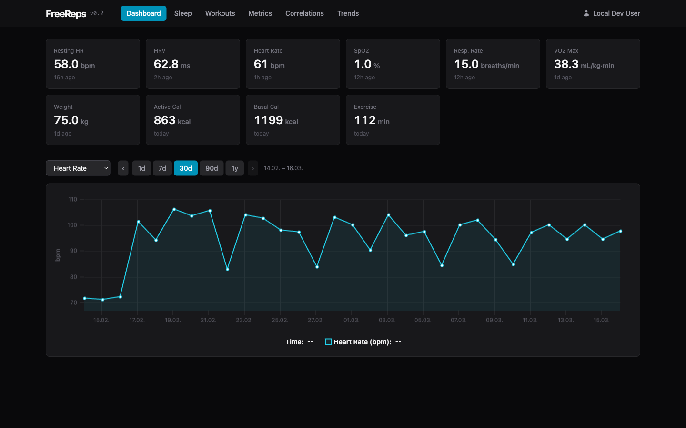
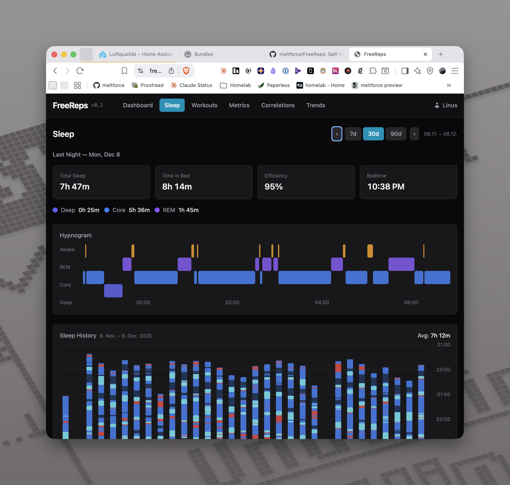
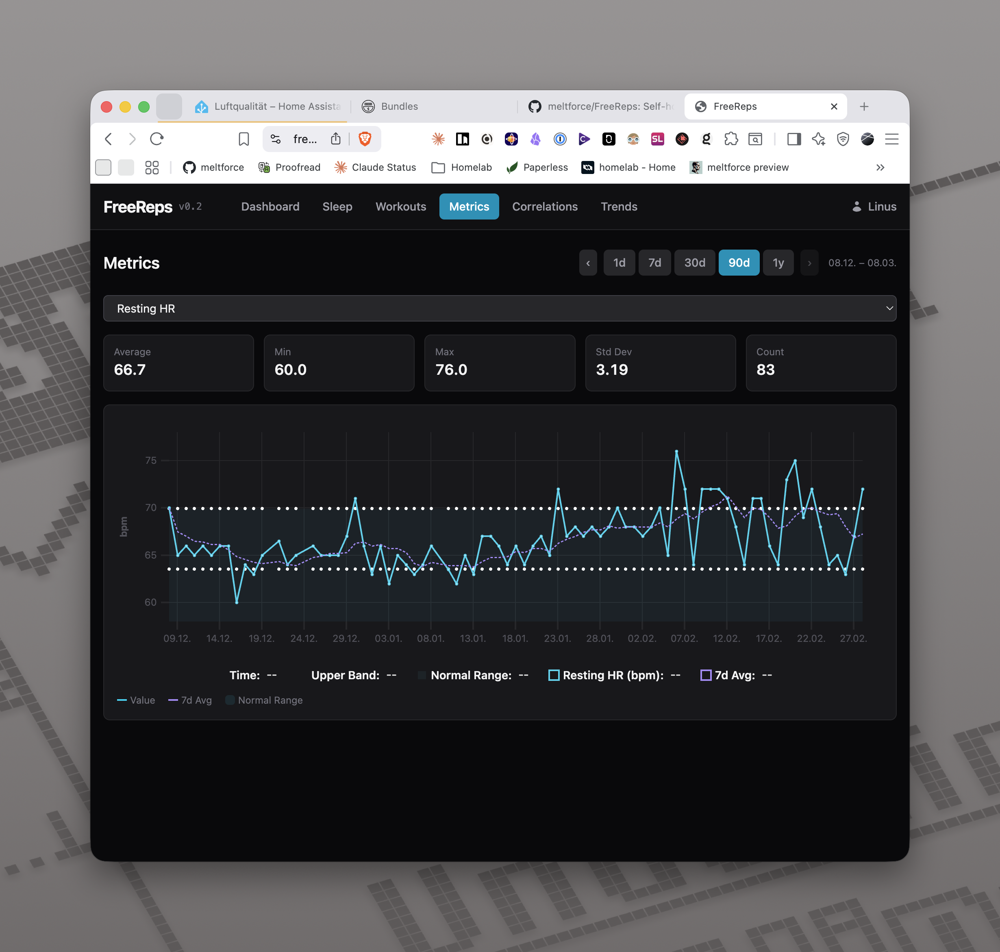
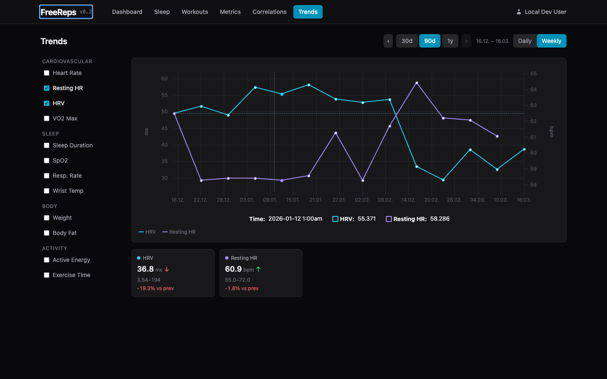
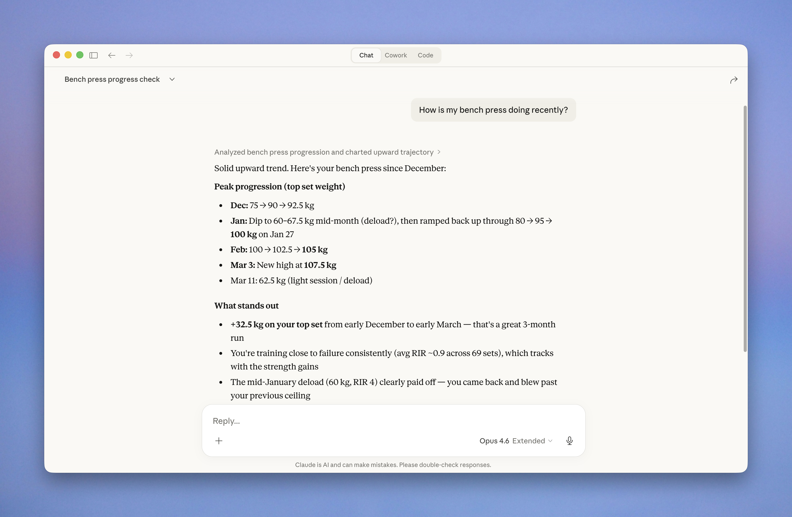
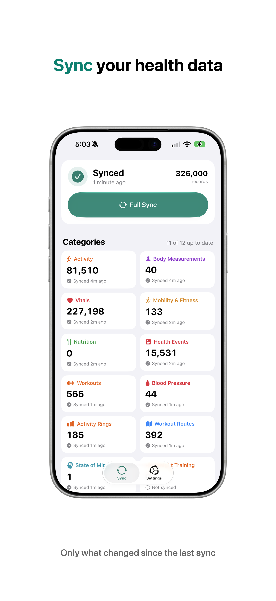
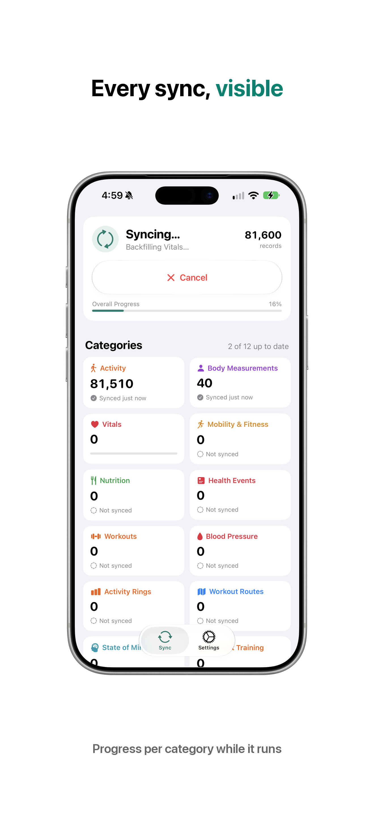
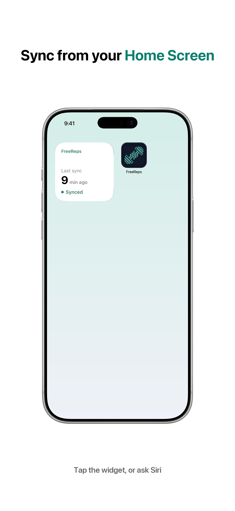
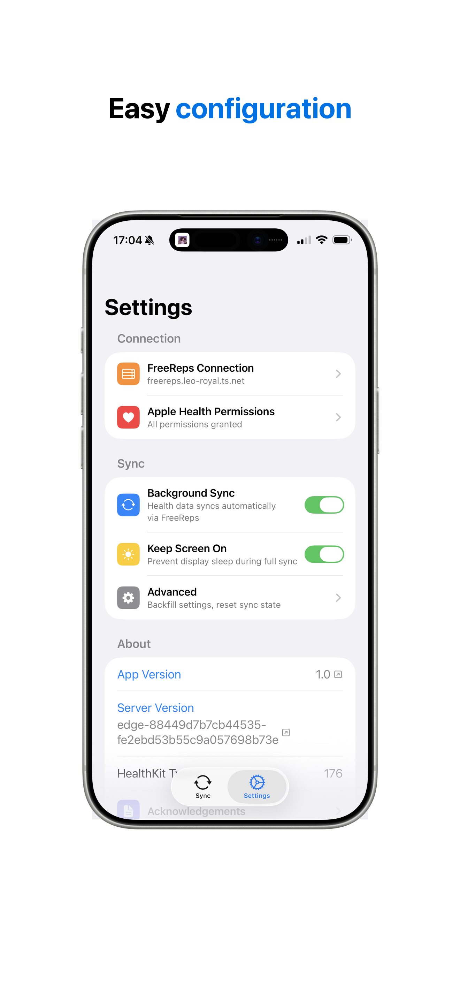

# FreeReps

**F**reely hosted **Re**cords, **E**valuation & **P**rocessing **S**erver

A self-hosted server that collects health and training data from Apple Health,
Oura, Withings and Hevy, stores it persistently, visualizes it through a web
dashboard with freely configurable correlations, and exposes it as an MCP server
for LLMs.

> **FreeReps for iOS 2.1 is coming to the App Store soon.** The version in the
> App Store today, 1.0, stopped syncing on iOS 27. Version 2.1 syncs on iOS 27,
> sends only what HealthKit added since the last sync, and starts a sync from
> the app, a Home Screen widget or Siri. It needs a FreeReps server of the same
> release, 2.1. See [iOS app](#ios-app).

## Dashboard Features

- **Daily overview** — the four hero numbers are chosen per user, each with its
  own sparkline, above a table of every visible metric
- **Correlation explorer** — any metric against any other, as a scatter plot
  with an overlay, Pearson r, and r recomputed at four lags from one payload
- **Sleep** — hypnogram, stage composition, and HR, HRV and SpO2 through the
  night
- **Workouts** — heart rate zones against a maximum the user sets or FreeReps
  estimates from a date of birth, the GPS route on a map, and the sets of a
  strength session
- **Metrics** — time series with a moving average and a normal range band
- **Trends** — small multiples across the metric set, over a selectable window
- **Settings** — per-metric visibility, which metrics the ingest accepts,
  source priority per category, the integrations, the ingest log, and the alert
  channel

## Screenshots

Each pair below is served in the colour scheme your client asks for. The MCP
capture is a screenshot of Claude Desktop, so it has one version only.

| Dashboard | Sleep |
|:-:|:-:|
| <picture><source media="(prefers-color-scheme: dark)" srcset="docs/screenshots/dashboard-dark.png"></picture> | <picture><source media="(prefers-color-scheme: dark)" srcset="docs/screenshots/sleep-dark.png"></picture> |

| Workouts | Metrics |
|:-:|:-:|
| <picture><source media="(prefers-color-scheme: dark)" srcset="docs/screenshots/workouts-dark.png"></picture> | <picture><source media="(prefers-color-scheme: dark)" srcset="docs/screenshots/metrics-dark.png"></picture> |

| Correlations | Trends |
|:-:|:-:|
| <picture><source media="(prefers-color-scheme: dark)" srcset="docs/screenshots/correlations-dark.png"></picture> | <picture><source media="(prefers-color-scheme: dark)" srcset="docs/screenshots/trends-dark.png"></picture> |

| MCP |
|:-:|
|  |

| iOS app | | | |
|:-:|:-:|:-:|:-:|
| <picture><source media="(prefers-color-scheme: dark)" srcset="docs/screenshots/ios/framed-dashboard-dark.png"></picture> | <picture><source media="(prefers-color-scheme: dark)" srcset="docs/screenshots/ios/framed-syncing-dark.png"></picture> | <picture><source media="(prefers-color-scheme: dark)" srcset="docs/screenshots/ios/framed-widget-dark.png"></picture> | <picture><source media="(prefers-color-scheme: dark)" srcset="docs/screenshots/ios/framed-settings-dark.png"></picture> |

## iOS app

[FreeReps for iOS](https://apps.apple.com/us/app/freereps/id6760661354) sends
Apple Health data straight to your server:

- **Only what changed** — after the first backfill, each sync sends what
  HealthKit added since the previous one.
- **A sync where you want it** — the Sync tab, a Home Screen widget that shows
  the last sync, or the Shortcuts action "Sync Health Data" for Siri, the Action
  button and personal automations. There is no background sync: HealthKit is
  unreadable while the iPhone is locked.
- **A fixed set of data** — 38 HealthKit types covering activity, body, vitals,
  sleep, workouts with routes, blood pressure and state of mind. Diagnoses,
  clinical records, prescriptions and symptoms are not read.
- **Your server decides** — metrics switched off in **Settings → Ingest** are
  skipped before the app reads HealthKit.

Version 2.1 needs iOS 27 and a FreeReps server 2.1. Setup, the Shortcuts
triggers that work and the developer notes are in [`app/README.md`](app/README.md).

## Why FreeReps?

Apple Health collects extensive data but offers no way to relate metrics to each other, no API for external analysis, and no export into a queryable system you own.

Other apps compute scores but are closed-source, subscription-based, and opaque. FreeReps takes the opposite approach: **raw data + flexible visualization + LLM for interpretation**.

## Architecture

```
  Apple Health ──┐
  (iPhone/Watch) │
                 │  Health Auto Export
                 │  ├─ REST automation  ──── HTTPS POST ───┐
                 │  ├─ .hae in iCloud ──┐                  │
                 │  └─ TCP/JSON-RPC ────┤ freereps-upload  │
                 │                      └──── HTTPS POST ──┤
                 │                                         │
  FreeReps iOS app ───────────────────── HTTPS POST ───────┤
  Alpha Progression CSV ──────── upload / POST /ingest/alpha┤
                                                           ▼
   Oura API v2    ←── OAuth2, 30 min ───┐    ┌──────────────────────────────┐
   Withings API   ←── OAuth2, 30 min ───┼───→│        FreeReps Server       │
   Hevy event feed←── API key, 30 min ──┘    │                              │
                                             │  Ingest ─→ Storage           │
                                             │            PostgreSQL +      │
                                             │            TimescaleDB       │
                                             │              │               │
                                             │   source-priority dedup at   │
                                             │   query time, per category   │
                                             │              │               │
                                             │  ┌───────────┼───────────┐   │
                                             │  ▼           ▼           ▼   │
                                             │ Web         MCP        Alert │
                                             │dashboard  stdio +     watcher│
                                             │          HTTP /mcp           │
                                             └──┼───────────┼───────────┼───┘
                                                ▼           ▼           ▼
                                             browser     Claude   ntfy topic
```

Every inbound channel writes into one store, and overlapping measurements are
resolved when a query runs rather than at ingest — see
[`DECISIONS.md`](DECISIONS.md), 2026-03-25.

## Design Principles

- **Privacy first** — Measurements stay on your server. FreeReps sends nothing
  outbound except the calls to the sources you connect and, if you enable it,
  the alert POST to a topic you name. No telemetry.
- **Self-hosted** — Runs on your own server/homelab.
- **Data over scores** — Raw data + visualization + LLM instead of proprietary algorithms.
- **Flexible over opinionated** — Correlation explorer instead of hard-wired dashboards.
- **Single binary** — Go binary with embedded web UI.

## Tech Stack

| Component | Technology |
|-----------|------------|
| Backend | Go (single binary with embedded frontend), chi router, pgx |
| Frontend | React 19 + Vite + TypeScript + Tailwind CSS 4 |
| Charts | uPlot (time series, sparklines, hypnogram), Leaflet (workout routes) |
| Database | PostgreSQL + TimescaleDB (hypertable on `health_metrics`) |
| Auth & Networking | [Tailscale](https://tailscale.com/) (tsnet) — zero-config TLS + identity |
| MCP | [mcp-go](https://github.com/mark3labs/mcp-go), stdio + Streamable HTTP |
| Migrations | [golang-migrate](https://github.com/golang-migrate/migrate), applied at startup |
| Config | YAML, with `FREEREPS_*` environment overrides |
| Deployment | Docker Compose |

The Go toolchain version is pinned in [`server/go.mod`](server/go.mod), the
frontend dependency versions in
[`server/web/package.json`](server/web/package.json).

## Prerequisites

- **[Tailscale](https://tailscale.com/)** — FreeReps uses Tailscale for authentication and TLS natively (via [tsnet](https://tailscale.com/kb/1244/tsnet)). There are no passwords or API keys — access is controlled by your tailnet. Tailscale must be set up before running FreeReps.
- **An iPhone with Apple Health data**, sending it through the [FreeReps iOS app](#freereps-ios-app) or [Health Auto Export](#health-auto-export-ios).
- **[mcp-proxy](https://github.com/sparfenyuk/mcp-proxy)** (optional) — Needed only by an MCP client that speaks stdio alone; it bridges stdio to the HTTP endpoint. Install with `brew install mcp-proxy` or `pip install mcp-proxy`.
- **`lzfse`** (optional, macOS) — Required by `freereps-upload` for reading `.hae` files. `brew install lzfse`.

## Quick Start

```bash
git clone https://github.com/meltforce/FreeReps.git
cd FreeReps/server
cp config.example.yaml config.yaml
# Edit config.yaml — set database password, enable Tailscale
docker compose up -d
```

To use the pre-built image from Docker Hub instead of building locally, replace the `app` service's `build: .` with `image: meltforce/freereps:latest` in `docker-compose.yml`.

## Data Sources

Apple Health data reaches FreeReps through the FreeReps iOS app or through
Health Auto Export. Both post to `/api/v1/ingest` and both write their rows
with an empty source; the server tells them apart by the client
(`health_metrics.client`), and where both delivered the same window the app's
rows count — see [`DECISIONS.md`](DECISIONS.md), 2026-09-25.

### FreeReps iOS app

1. Install [FreeReps](https://apps.apple.com/us/app/freereps/id6760661354) on
   an iPhone in your tailnet.
2. In **Settings**, set the host to the server's Tailscale name and grant the
   Apple Health permissions. On iOS 27, choose **All Recorded Data** in the
   second permission step; **Past 30 Days** hides everything older.
3. Under **Advanced**, choose how far back the first sync reaches, then tap
   **Full Sync** on the Sync tab.

Later syncs send only what HealthKit added. The app identifies itself with
`X-FreeReps-Client: freereps-ios`; its ingests appear as `freereps_ios` in
**Settings → Ingest**. [`app/README.md`](app/README.md) has the details.

### Health Auto Export (iOS)

[Health Auto Export](https://www.healthyapps.dev/apps/health-auto-export/) reads
HealthKit on the iPhone and delivers it over three paths, which can be combined:

| Path | What it is | Used for |
|---|---|---|
| **REST automation** | The app posts JSON to a URL on a schedule | Ongoing delivery — this is the default |
| **TCP server connection** | The app answers JSON-RPC queries on the local network | Historical backfill, via `freereps-upload -hae-host` |
| **`.hae` file export** | The app writes compressed files to iCloud Drive | Historical backfill, via `freereps-upload -path` |

**Setting up the REST automation:**

1. Open **Settings → Ingest** in FreeReps and copy the server URL shown there
   (`https://<your-host>/api/v1/ingest`).
2. In Health Auto Export, create an automation of type **REST API**, paste that
   URL, and set the format to **JSON**.
3. Select the metrics and workouts to export. Aggregation and period are the
   app's own settings; `sinceLastSync` keeps each delivery to what is new.
4. Save it. **Settings → Ingest** lists the last 25 deliveries with the row
   counts each one carried.

The iPhone reaches the server over the tailnet, so the automation needs no API
key of its own — Tailscale authenticates the request. The payload shape FreeReps
accepts is written down in
[`server/specs/hae-rest-api.md`](server/specs/hae-rest-api.md).

**Backfilling history:** a REST automation delivers from the moment it is set
up. For everything before that, use `freereps-upload` in TCP mode against the
app's server connection, or in file mode against an iCloud export — see
[Upload Tool](#upload-tool-macos).

### Oura Ring

FreeReps integrates directly with the Oura API v2 to pull ring data. Syncs every 30 minutes with 90-day initial backfill.

**Data synced:**
- **Oura-exclusive** — readiness score, sleep score, activity score, temperature deviation, stress, recovery, resilience, cardiovascular age
- **Overlapping with Apple Watch** — heart rate, HRV, SpO2, respiratory rate, steps, active calories, workouts, sleep sessions/stages

**Source priority dedup:** When both Oura and Apple Watch report the same metric, FreeReps deduplicates at query time using configurable source priority (Settings > Source Priority). Only the highest-priority source's data is shown — no double-counting.

#### Oura Setup

1. **Register an Oura API app** at [cloud.ouraring.com/oauth/applications](https://cloud.ouraring.com/oauth/applications):
   - Redirect URI: the exact value shown under Settings > Oura Ring. FreeReps
     derives it from the address you reach it on, so it needs no configuration —
     see [Redirect URIs](#redirect-uris) if you need to pin it.
   - Privacy Policy URL: your FreeReps website's privacy page
   - Terms of Service URL: your FreeReps website's terms page
   - Enable all scopes

2. **Enter credentials in FreeReps**: Go to Settings > Oura Ring, enter your Client ID and Client Secret, click "Save Credentials"

3. **Authorize**: Click "Authorize with Oura", approve access on Oura's page. You'll be redirected back to FreeReps.

4. **Sync starts automatically** every 30 minutes. Use "Sync Now" for immediate sync. Check Settings > Import Logs for sync status.

### Withings

FreeReps reads weight, body composition and blood pressure directly from the
Withings Public API. Syncs every 30 minutes with 90-day initial backfill.

**Data synced:** weight, fat ratio, fat mass, fat free mass, muscle mass, bone
mass, body water, blood pressure (systolic/diastolic) and the pulse the cuff
records with each reading.

The same measurements also reach FreeReps through Apple Health, where they
arrive only once the Health app has synced. The default source priority puts
Withings first, so the direct read wins wherever both cover a day. The Apple
Health path is not disabled — it remains the only route for an installation
without a Withings account.

#### Withings Setup

1. **Register an app** in the [Withings Partner Hub](https://developer.withings.com/dashboard/).
   The Public API tier requires no contract and no approval.
   - Redirect URI: the exact value shown under Settings > Withings. It follows
     the address you reach FreeReps on, so renaming a host changes it — and the
     OAuth callback is the only place that breaks, because token refresh sends no
     redirect URI. See [Redirect URIs](#redirect-uris).
   - Scope: `user.metrics`

2. **Enter credentials in FreeReps**: Settings > Withings, enter Client ID and
   Client Secret, click "Save credentials".

3. **Authorize**: Click "Authorize with Withings" and approve access. The
   authorization code is valid for 30 seconds, so complete the redirect rather
   than leaving the consent page open.

4. **Sync starts automatically** every 30 minutes. Use "Sync now" for an
   immediate run; Settings > Import Logs carries the outcome.

### Redirect URIs

Both OAuth integrations need a redirect URI registered with the provider, and it
has to match what FreeReps sends — the provider compares the value from the start
of the flow with the one sent when the code is exchanged.

**FreeReps derives it per request** from the origin you reached it on:
`https://<host>/oura/callback` and `https://<host>/withings/callback`. A reverse
proxy's `X-Forwarded-Proto` and `X-Forwarded-Host` are honoured. The current value
is shown in the Settings tab of each integration, which is the value to paste into
the provider's form.

**Pin it** where the derived value is not stable or not the registered one — the
UI answering on several names, or a proxy under a name the headers do not carry:

```yaml
server:
  base_url: "https://freereps.example.ts.net"   # scheme and host only
```

`FREEREPS_SERVER_BASE_URL` overrides the same value. A path in it is refused at
startup rather than producing a URI the provider rejects at the end of a flow.

### Hevy

[Hevy](https://www.hevyapp.com/) is the strength training source. FreeReps polls
`GET /v1/workouts/events?since=` every 30 minutes, which carries creations,
updates *and* deletions, so a correction made in the app reaches the server on
the next run. Hevy's webhook is not used —
[`DECISIONS.md`](DECISIONS.md), 2026-08-04, has the reasoning.

**Data synced:** sessions with exercise, set, rep, weight and effort data. RPE
and RIR are stored on their own scales rather than converted at ingest. The
exercise catalog is pulled as well, which is what supplies the muscle group per
exercise.

**Derived from it:** volume per muscle group, tonnage (`SUM(weight_kg * reps)`,
external load only) and estimated 1RM per exercise per session (Epley over reps
plus reps in reserve). Tonnage is materialised into `health_metrics` as
`strength_tonnage`, so it can be correlated against sleep, HRV or readiness like
any other series.

#### Hevy Setup

1. **Get an API key** from Hevy (Hevy Pro, developer settings).
2. **Enter it in FreeReps**: Settings → Hevy, paste the key, set **Sync from**
   to the first date to import, click save. The key is verified against Hevy
   before it is stored.
3. **Sync runs every 30 minutes.** Use "Sync now" for an immediate run;
   Settings → Import Logs carries the outcome.

The **Sync from** cutoff is what keeps a Hevy history and an imported Alpha
Progression history from covering the same period twice — the training
aggregates sum across sources without filtering on one.

### Alpha Progression (CSV)

[Alpha Progression](https://alphaprogression.com) was the strength logger before
Hevy, and its CSV export is still the way to bring that history in: exercises,
sets, reps, weight and RIR. Its exercise names are mapped onto Hevy's catalog at
ingest, so one exercise keeps one identity across both sources.

Upload it under Settings → Import, or POST it to `/api/v1/ingest/alpha`.

The export carries a bare wall clock with no time zone, and the resulting
instant is part of a row's natural key. `ingest.session_timezone` in
`config.yaml` decides how that clock is read, and it has to be the same on every
host that imports the same export — reading one export in two zones stores every
session twice ([`INCIDENTS.md`](INCIDENTS.md), 2026-08-10).

## Supported Metrics

124 metric names are on the allowlist. `GET /api/v1/metrics/available` returns
the list the running instance actually carries, with its display metadata; the
table below names the groups. Each user switches metrics off for their own
ingest in **Settings → Ingest**; a metric switched off is rejected from every
client and its stored rows are kept. The iOS app reads a subset of 38 types;
Health Auto Export sends what its automation selects.

| Category | Metrics |
|----------|---------|
| Cardiovascular | `heart_rate`, `resting_heart_rate`, `heart_rate_variability`, `heart_rate_recovery_one_minute`, `blood_oxygen_saturation`, `respiratory_rate`, `vo2_max`, `blood_pressure_systolic`, `blood_pressure_diastolic`, `blood_pressure_heart_rate`, `atrial_fibrillation_burden` |
| Sleep | `sleep_analysis`, `apple_sleeping_wrist_temperature` |
| Body | `weight_body_mass`, `body_mass_index`, `body_fat_percentage`, `fat_mass`, `lean_body_mass`, `muscle_mass`, `bone_mass`, `body_water`, `height` |
| Activity | `active_energy`, `basal_energy_burned`, `step_count`, `flights_climbed`, `apple_exercise_time`, `apple_stand_time`, `apple_move_time`, the four `distance_*` series |
| Strength | `strength_tonnage` — external load per session, derived from Hevy and Alpha sets |
| Oura | `oura_readiness_score`, `oura_sleep_score`, `oura_activity_score`, `oura_temperature_deviation`, `oura_stress_high`, `oura_recovery_high`, `oura_resilience`, `oura_cardiovascular_age` |
| Nutrition | 40 `dietary_*` series — macros, minerals, vitamins, caffeine, water |
| Clinical | `blood_glucose`, `blood_alcohol_content`, `forced_vital_capacity`, `forced_expiratory_volume_1`, `electrodermal_activity` |
| Environment | `environmental_audio_exposure`, `headphone_audio_exposure` |
| Cycling | `cycling_power`, `cycling_cadence`, `cycling_speed`, `cycling_functional_threshold_power` |
| Workouts | All types, with heart rate, routes and sets, deduped across sources |

Records that are not time series of a single number — ECG recordings,
audiograms, medications, vision prescriptions, State of Mind entries and raw
HealthKit category samples — are stored in their own tables and read through
their own endpoints and MCP tools.

## MCP Server

FreeReps exposes health data to Claude (and other LLMs) via the Model Context
Protocol, over two transports:

- **stdio**, for a client that starts the binary itself.
- **Streamable HTTP** at `/mcp`, served by the same HTTP server as the
  dashboard and behind the same Tailscale identity middleware, so each user
  sees only their own data.

There is no SSE endpoint. `/mcp/sse` matches no route, so the request reaches
the dashboard handler and the response is HTML — which a client reports as a
protocol error rather than as a wrong URL.

**Tools (20):**

| Group | Tools |
|---|---|
| Metrics | `get_health_metrics`, `get_metric_stats`, `list_available_metrics`, `get_correlation`, `compare_periods` |
| Sleep | `get_sleep_data`, `get_sleep_summary` |
| Workouts | `get_workouts`, `get_workout_sets` |
| Strength | `get_strength_summary`, `get_strength_volume`, `get_strength_intensity`, `get_strength_1rm` |
| Clinical records | `get_ecg_recordings`, `get_audiograms`, `get_medications`, `get_vision_prescriptions` |
| Other samples | `get_activity_summaries`, `get_state_of_mind`, `get_category_samples` |

**Resources (3):** `daily_summary`, `recent_workouts`, `metric_catalog`

The running server is the authority on this list — ask it rather than this
table if the two disagree.

### stdio (Claude Code)

```bash
freereps --mcp -config config.yaml
```

Add to your Claude Code MCP config:

```json
{
  "mcpServers": {
    "freereps": {
      "command": "/path/to/freereps",
      "args": ["--mcp", "-config", "/path/to/config.yaml"]
    }
  }
}
```

### Streamable HTTP (remote clients)

`/mcp` speaks Streamable HTTP as soon as the server is running. A client that
can address an HTTP MCP endpoint needs nothing else — the URL is
`https://freereps.your-tailnet.ts.net/mcp`, and Tailscale authenticates the
request.

For a client that only speaks stdio, [mcp-proxy](https://github.com/sparfenyuk/mcp-proxy)
bridges the two:

```bash
brew install mcp-proxy   # or: pip install mcp-proxy
```

```json
{
  "mcpServers": {
    "freereps": {
      "command": "mcp-proxy",
      "args": ["--transport", "streamablehttp", "https://freereps.your-tailnet.ts.net/mcp"]
    }
  }
}
```

No local FreeReps binary and no database access are needed on the client side.

## Alerts

An integration that stops delivering is the failure this project could not see:
the container is healthy, the dashboard answers, and a source simply writes no
more rows. FreeReps therefore reports that state itself, as a JSON POST to an
[ntfy](https://ntfy.sh) topic — or to any endpoint that accepts one.

The conditions are evaluated from `import_logs` rather than from inside the sync
loops, so a syncer that stopped running is covered as well:

| `monitor_id` | Condition |
|---|---|
| 9200 | the manual test from Settings → Alerts |
| 9201 | the Withings sync failed the configured number of times in a row |
| 9202 | the Oura sync failed the configured number of times in a row |
| 9203 | the Hevy sync failed the configured number of times in a row |
| 9204 | no Health Auto Export delivery for longer than the silence threshold |

The payload follows Uptime Kuma's webhook shape, so an existing Kuma consumer
needs no second parser:

```json
{
  "schema": 1,
  "monitor_id": 9201,
  "service": "freereps - withings sync",
  "status": 0,
  "hostname": "freereps",
  "monitor_type": "freereps",
  "since": "2026-09-20T11:18:08Z",
  "msg": "3 consecutive failed runs — user 2 since 2026-09-20T09:41:56Z: …"
}
```

`status` is `0` for a problem and `1` for its resolution. Four rules shape what
arrives:

- **One message per transition.** The state per condition is stored
  (`alert_state`), so a problem is reported when it starts and again when it
  clears — not on every check cycle.
- **A resolution always follows.** A condition that only ever sent `0` would
  leave a stale alert in whatever reads the topic.
- **A threshold sits in front of the channel.** The default is three consecutive
  failed runs of one source for one user, which at a 30-minute sync interval
  reports a real defect within two hours while a single DNS timeout stays out.
- **The state is written after the send succeeded.** An unreachable topic delays
  an alert; it does not swallow it.

Failures are counted per user, because a second user whose sync works would
otherwise mask a first user whose sync does not.

### Configuring it

Settings → **Alerts**: the topic URL, the name to report as, the check interval,
the failure threshold, the silence threshold, and a button that posts a test
message on 9200 with `status: 1`. The values live in the database; the `alerts`
block in `config.yaml` seeds them on first start only, so a redeploy cannot
overwrite what was entered in the UI.

```yaml
alerts:
  enabled: false
  ntfy_url: "https://ntfy.example.com/freereps-alerts"
  hostname: "freereps"
  check_interval: "5m"
  failure_threshold: 3
  apple_silence: "36h"   # 0 turns the Health Auto Export rule off
```

Reading the topic back is the quickest way to tell "FreeReps did not send" from
"the subscriber did not receive":

```bash
curl -s "https://ntfy.example.com/freereps-alerts/json?poll=1&since=10m"
```

## Tools

A server seeded with generated data, for a first look, and the CLI that
backfills Apple Health history into a running instance.

### Test server (demo mode)

Run a FreeReps server with demo data, for a first look or for testing an ingest path against a database that carries no real measurements:

**Using Docker (recommended)**

```bash
cd FreeReps/server
cp config.example.yaml config.yaml
# Set tailscale.enabled: false in config.yaml for local dev

docker compose up -d db
docker compose run --rm -e FREEREPS_DEMO=true app
```

**From source**

```bash
cd FreeReps/server
cp config.example.yaml config.yaml
# Set tailscale.enabled: false in config.yaml for local dev

docker compose up -d db
cd web && npm ci && npm run build && cd ..
go run ./cmd/freereps -config config.yaml -demo
```

This seeds the database with 90 days of generated health data — heart rate, sleep, workouts, activity rings and strength sessions with sets, reps and effort ratings. The data is deterministic and idempotent — restarting with `-demo` or `FREEREPS_DEMO=true` won't create duplicates.

The server will be available at `http://localhost:8080`. To tear down:

```bash
docker compose down -v
```

### Upload tool (macOS)

`freereps-upload` is a client-side CLI tool that brings historical
[Health Auto Export](https://www.healthyapps.dev/apps/health-auto-export/) data
into FreeReps. It runs in two modes:

- **File mode** (`-path`) reads the `.hae` files Health Auto Export writes to
  iCloud Drive, converts them to the REST format and posts them to the server.
- **TCP mode** (`-hae-host`) queries the app's own server connection over
  JSON-RPC and walks a date range in chunks, so a backfill needs no file export
  at all.

**Install:**

```bash
curl -sSL https://raw.githubusercontent.com/meltforce/FreeReps/main/server/scripts/install-upload.sh | bash
```

**Usage:**

```bash
# First run — upload all historical data
freereps-upload \
  -server https://freereps.your-tailnet.ts.net \
  -path ~/Library/Mobile\ Documents/com~apple~CloudDocs/Health\ Auto\ Export/AutoSync

# Subsequent runs — only new/changed files are uploaded (resumable)
freereps-upload \
  -server https://freereps.your-tailnet.ts.net \
  -path ~/Library/Mobile\ Documents/com~apple~CloudDocs/Health\ Auto\ Export/AutoSync
```

**Flags:**

| Flag | Default | Description |
|------|---------|-------------|
| `-server` | (required) | FreeReps server URL |
| `-path` | | Path to AutoSync directory (or parent) — file mode |
| `-batch-size` | 2000 | Data points per metric payload (file mode) |
| `-hae-host` | | IP address of the Health Auto Export TCP server — TCP mode |
| `-hae-port` | 9000 | Port of the Health Auto Export TCP server |
| `-start` | 1 year ago | Start date of the backfill, `yyyy-MM-dd` (TCP mode) |
| `-end` | today | End date of the backfill, `yyyy-MM-dd` (TCP mode) |
| `-chunk-days` | 1 | Days per query chunk (TCP mode) |
| `-dry-run` | false | Parse and convert without sending |
| `-version` | | Print version and exit |

**Requirements:** `lzfse` must be installed for file mode (`brew install lzfse`).

**Update / Uninstall:**

```bash
# Update to latest version
curl -sSL https://raw.githubusercontent.com/meltforce/FreeReps/main/server/scripts/install-upload.sh | bash -s -- --update

# Uninstall
curl -sSL https://raw.githubusercontent.com/meltforce/FreeReps/main/server/scripts/install-upload.sh | bash -s -- --uninstall
```

**State tracking (file mode):** Upload progress is tracked in `~/.freereps-upload/state.db` (SQLite). Files are identified by path + size + SHA-256 hash, so changed files are re-uploaded and the tool is fully resumable.

## API Reference

Every route below sits behind the Tailscale identity middleware and answers for
the calling user only. `/api/v1/version` is the exception — it answers without
an identity, so a health check needs no credentials.

| Endpoint | Method | Description |
|----------|--------|-------------|
| `/api/v1/version` | GET | Build version (no identity required) |
| `/api/v1/me` | GET | Current user identity |
| `/api/v1/ingest/` | POST | Ingest health data JSON (Health Auto Export REST; the iOS app with `X-FreeReps-Client: freereps-ios`) |
| `/api/v1/ingest/alpha` | POST | Ingest Alpha Progression CSV |
| `/api/v1/import` | POST | Unified import (auto-detects format) |
| `/api/v1/import/hae-tcp/check` | POST | Probe a Health Auto Export TCP server |
| `/api/v1/import/hae-tcp` | POST/DELETE | Start or cancel a TCP backfill |
| `/api/v1/import/hae-tcp/status` | GET | Progress of the running backfill |
| `/api/v1/import/hae-tcp/events` | GET | Progress as a server-sent event stream |
| `/api/v1/metrics/latest` | GET | Latest value per metric |
| `/api/v1/metrics` | GET | Time-range metric query |
| `/api/v1/metrics/stats` | GET | Metric statistics (avg, min, max, stddev) |
| `/api/v1/metrics/available` | GET | Available metrics with display metadata |
| `/api/v1/metrics/visibility` | PUT | Save per-user metric visibility |
| `/api/v1/timeseries` | GET | Time-bucketed metric data |
| `/api/v1/correlation` | GET | Pearson r between two metrics |
| `/api/v1/allowlist` | GET | Metric allowlist, `enabled` resolved for the calling user |
| `/api/v1/metrics/enabled` | PUT | Save per-user ingest enablement |
| `/api/v1/sleep` | GET | Sleep sessions + stages |
| `/api/v1/workouts` | GET | Workout list with filters |
| `/api/v1/workouts/zones` | GET | Heart rate zone distribution |
| `/api/v1/workouts/{id}` | GET | Workout detail |
| `/api/v1/workouts/{id}/sets` | GET | Strength sets of a session |
| `/api/v1/training-metrics/rebuild` | POST | Recompute the derived training series |
| `/api/v1/ecg` | GET | ECG recordings |
| `/api/v1/audiograms` | GET | Audiograms |
| `/api/v1/activity-summaries` | GET | Daily activity ring totals |
| `/api/v1/medications` | GET | Medication records |
| `/api/v1/vision-prescriptions` | GET | Vision prescriptions |
| `/api/v1/state-of-mind` | GET | State of Mind entries |
| `/api/v1/category-samples` | GET | HealthKit category samples |
| `/api/v1/preferences/front-page-heroes` | PUT | The four numbers on the front page |
| `/api/v1/preferences/max-heart-rate` | GET/PUT | Maximum heart rate for the zone split |
| `/api/v1/preferences/birth-date` | GET/PUT | Date of birth, used to estimate the maximum when none is set |
| `/api/v1/source-priority` | GET/PUT | Source priority configuration |
| `/api/v1/source-priority/{category}` | DELETE | Remove one category's rule |
| `/api/v1/oura/status` | GET | Oura connection status |
| `/api/v1/oura/credentials` | PUT | Save Oura OAuth2 credentials |
| `/api/v1/oura/authorize` | POST | Start Oura OAuth2 flow |
| `/api/v1/oura/sync` | POST | Trigger manual Oura sync |
| `/api/v1/oura/disconnect` | DELETE | Remove Oura connection |
| `/api/v1/withings/status` | GET | Withings connection status |
| `/api/v1/withings/credentials` | PUT | Save Withings OAuth2 credentials |
| `/api/v1/withings/authorize` | POST | Start Withings OAuth2 flow |
| `/api/v1/withings/sync` | POST | Trigger manual Withings sync |
| `/api/v1/withings/disconnect` | DELETE | Remove Withings connection |
| `/api/v1/hevy/status` | GET | Hevy connection status |
| `/api/v1/hevy/credentials` | PUT | Save the Hevy API key and sync cutoff |
| `/api/v1/hevy/sync` | POST | Trigger manual Hevy sync |
| `/api/v1/hevy/disconnect` | DELETE | Remove the Hevy API key |
| `/api/v1/alerts` | GET/PUT | Alert channel configuration and per-condition state |
| `/api/v1/alerts/test` | POST | Post a test message on `monitor_id` 9200 |
| `/api/v1/stats` | GET | Row counts and coverage per source |
| `/api/v1/import-logs` | GET | Recent ingest and sync runs |
| `/mcp` | POST/GET/DELETE | MCP over Streamable HTTP |

## Documents

| File | Holds |
|---|---|
| [`CLAUDE.md`](CLAUDE.md) | Conventions and gotchas for working in this repo. |
| [`ROADMAP.md`](ROADMAP.md) | Open work. |
| [`DECISIONS.md`](DECISIONS.md) | Decisions taken, with reasoning. |
| [`INCIDENTS.md`](INCIDENTS.md) | Postmortems. |
| [`server/specs/`](server/specs/) | Wire formats and payload shapes of the ingest sources. |
| [`app/README.md`](app/README.md) | The iOS companion app. |
| [`docs/mcp-server.md`](docs/mcp-server.md) | The MCP server in detail. |

## License

[MIT](LICENSE)

